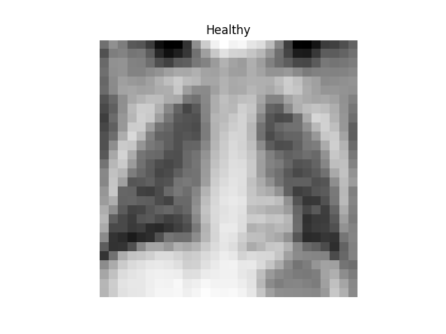
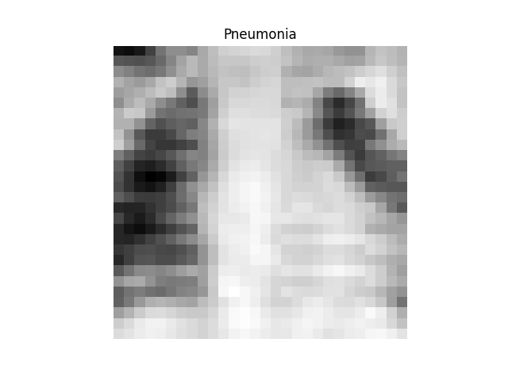

## Pneumonia MNIST Classifier - Transfer Learning - Hyperparameter Tuning

Convolutional neural network to classify images of the
[PneumoniaMNIST](https://zenodo.org/records/10519652) dataset by leveraging transfer
learning. Learning rate, and the number of neurons and dropout of the custom
classification layer are fine-tuned using the 
[`keras-tuner`](https://keras.io/keras_tuner/) library.

For educational purposes. Code with docstrings and type hints. Tested with Python 3.12
and Tensorflow 2.16.1.

  
   

### Repo Structure
* `config`\: configuration files. Remove the `.template` string from the 
  configuration filenames.
* `hyperparameter_tuning`\: contains the optimal hyperparameter file and tuning history.
* `src`\
  * `preprocess.py`: generation of the training, validation and test datasets.
  * `hyperparameter_tuner.py`: hyperparameter tuner.
  * `trainer.py`: model training with the optimal hyperparameters computed by `hyperparameter_tuner.py`.
  * `evaluator.py`: model evaluation.
* `training`\: contains the trained model with optimal hyperparameters and history.

